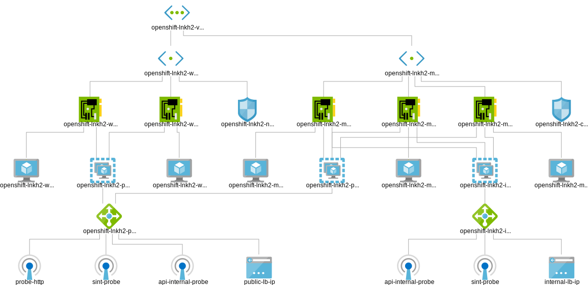

## Openshift Container Platform 4 deployment on Azure Public Cloud using User provisioned Infrastructure (developed on OCP 4.2 version)



Preparation:
Follow the the link to get your environment ready: https://github.com/openshift/installer/tree/master/docs/user/azure

About the OCP on Azure - Theory: https://docs.openshift.com/container-platform/3.11/install_config/configuring_azure.html#configuring-azure-objects_configuring-for-azure

Also process described here (even though this is for AWS) is similar for Azure, except CloudFormation templates:
https://docs.openshift.com/container-platform/4.1/installing/installing_aws_user_infra/installing-aws-user-infra.html#installation-creating-aws-worker_installing-aws-user-infra

1. generate install config files:<br>
`./openshift-install create install-config --dir=ignition-files`
  
Edit the ignition-files/install-config.yaml file to set the number of compute, or worker, replicas to 0, as shown in the following compute stanza:
```
compute:
- hyperthreading: Enabled
  name: worker
  platform: {}
  replicas: 0
```

2. generate kubernetes manifests:<br>
`./openshift-install create manifests --dir=ignition-files`

Remove the files that define the control plane machines:<br>
`rm -f ignition-files/openshift/99_openshift-cluster-api_master-machines-*.yaml`

Remove the Kubernetes manifest files that define the worker machines:<br>
`rm -f ignition-files/openshift/99_openshift-cluster-api_worker-machineset-*`

Because you create and manage the worker machines yourself, you do not need to initialize these machines.<br>

3. Obtain the Ignition config files:<br>
`./openshift-install create ignition-configs --dir=ignition-files`

4. Extract the infrastructure name from the Ignition config file metadata, run the following command:<br>
`jq -r .infraID ignition-files/metadata.json`

Place the name to terraform vars file as "cluster_id".<br>

Fill in other information in terraform vars:
```
  "azure_subscription_id": ""
  "azure_client_id": ""
  "azure_client_secret": ""
  "azure_tenant_id": ""
  "azure_base_domain_resource_group_name": ""
  "cluster_id": "", <- infrastructure name form metadata.json 
  "cluster_domain": "", <- cluster name from install-config.yaml (e.g. openshiftpoc)
  "base_domain": "" <- base domain
```

5. Run terraform scripts:<br>
`terraform apply -var-file="terraform.tfvars.json"`

6. Wait for Cluster to complete installation:<br>
`./openshift-install wait-for install-complete --dir=ignition-files`

### Scale Up

In order to add aditional worker node, use terraform scripts in scaleup directory.<br>

Fill in other information in terraform vars:
```
    "azure_worker_vm_type": "Standard_D2s_v3",
    "azure_worker_root_volume_size": 64,
    "azure_image_id": "/resourceGroups/rhcos_images/providers/Microsoft.Compute/images/rhcostestimage",
    "azure_region": "uksouth",
    "cluster_id": ""
```

1. Run terraform init and the script:<br>
`terraform apply -var-file="terraform.tfvars.json"`

2. It will ask you to provide the Azure Availability Zone number where you would like to deploy new node and to provide the worker node number (if it is 4th node, then the number is 3)

3. Watch for `oc get csr` and approve any pending CSRs with `oc adm certificate approve <csr id>`
